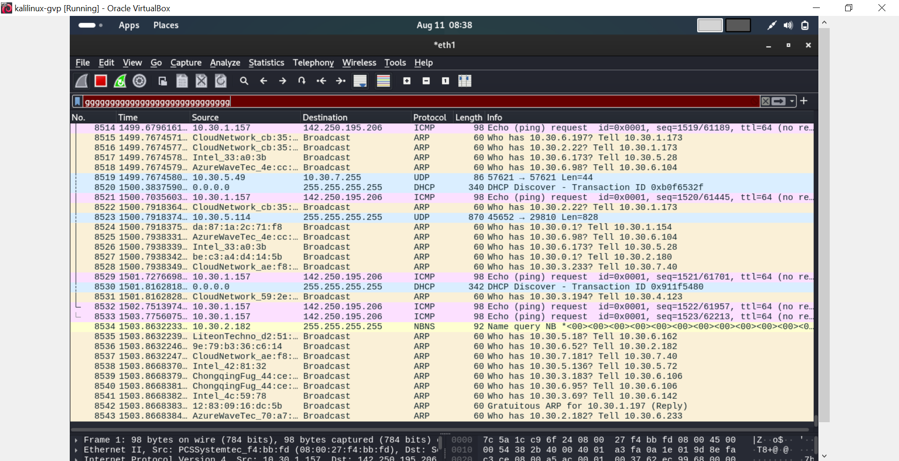
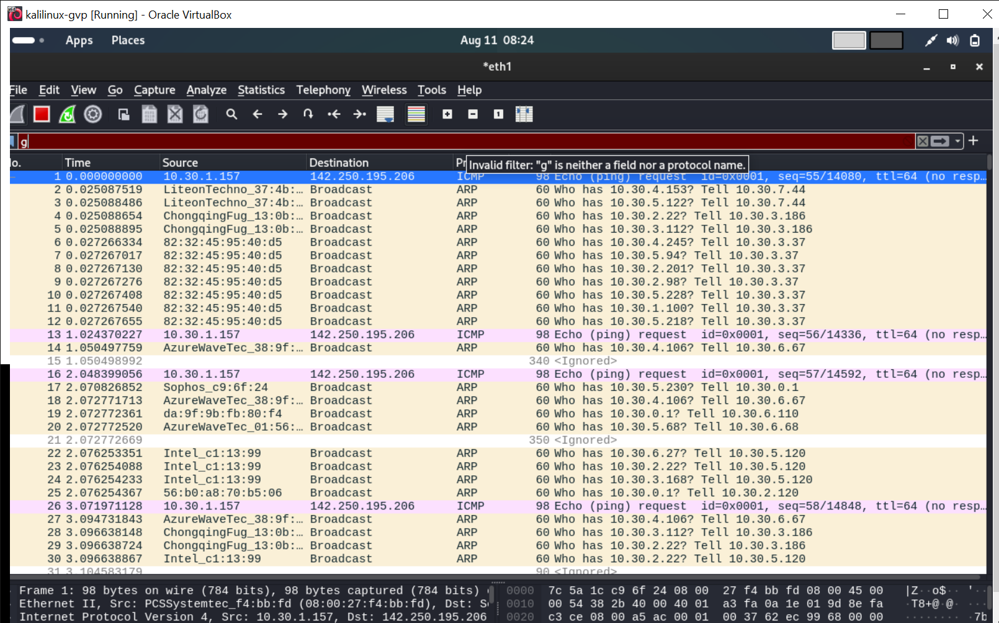
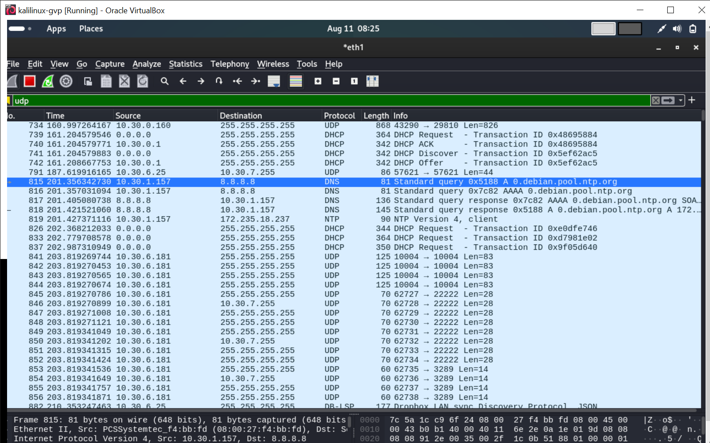
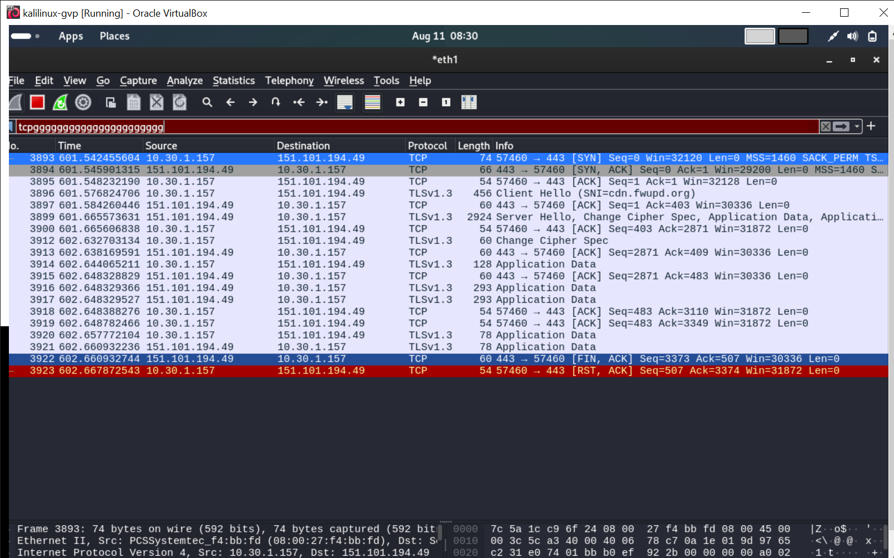

# 🛠 Task 5: Capture and Analyze Network Traffic Using Wireshark

## 📌 Objective
Capture live network packets and identify basic protocols and traffic types using Wireshark.

## 🖥 Tools Used
- **Wireshark** (for packet capture and analysis)
- **Windows 10/11** (testing environment)
- **Scapy** (for generating test packets)

## 📂 Deliverables
- `task5_capture.pcap` — packet capture file
- Short protocol analysis report (below)
- Screenshots of capture & analysis

---

## 📸 Screenshots

### 1. **Wireshark Capture Overview**

### 2. **DNS Packet Details**

### 3. **TCP Handshake**

### 4. **HTTP GET Request**

---

## 📊 Protocols Identified

### 1. **DNS (Domain Name System)**
- **Purpose:** Resolves domain names (e.g., `google.com`) to IP addresses.
- **Sample Packet:** Query for `google.com` to `8.8.8.8`.

### 2. **TCP (Transmission Control Protocol)**
- **Purpose:** Reliable, connection-oriented communication.
- **Sample Packet:** SYN packet initiating a connection to `142.250.190.14` (Google).

### 3. **HTTP (HyperText Transfer Protocol)**
- **Purpose:** Request/response for web content.
- **Sample Packet:** HTTP GET request to `example.com`.

---

## 📝 Observations
- DNS queries are quick and small in size.
- TCP ensures reliability before sending HTTP data.
- HTTP traffic is sent in plain text (unlike HTTPS which is encrypted).

---

---

## 📎 How to Open `.pcap` File
1. Install [Wireshark](https://www.wireshark.org/download.html).
2. Open `task5_capture.pcap` in Wireshark.
3. Use filters (`dns`, `tcp`, `http`) to view specific protocols.
